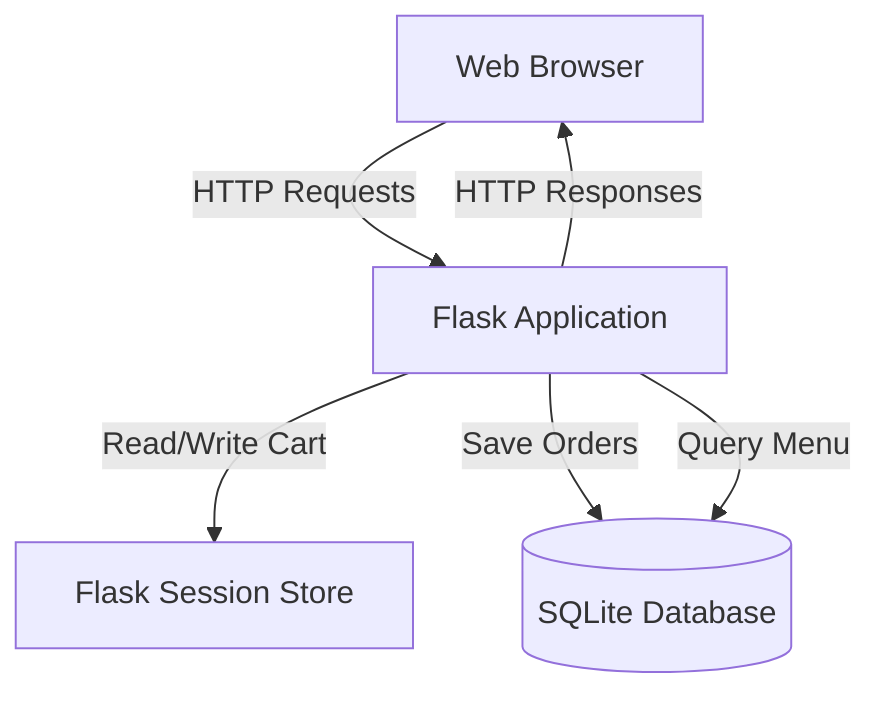
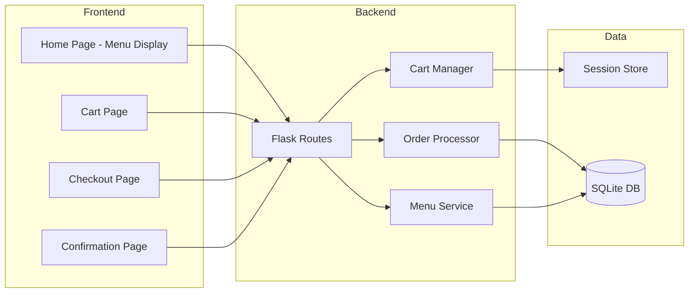

# Design Document: Pizza Shop Website

## Overview

The Pizza Shop Website is a full-stack web application that enables customers to browse a pizza menu, manage a shopping cart, and place orders online. The system follows a traditional three-tier architecture with a Flask-based backend, HTML/CSS/Bootstrap frontend, and SQLite database for persistence.

### Technology Stack

- **Backend**: Python Flask (web framework)
- **Frontend**: HTML5, CSS3, Bootstrap 5 (responsive UI framework)
- **Database**: SQLite (embedded relational database)
- **Session Management**: Flask sessions with server-side storage

### Key Design Principles

1. **Simplicity**: Minimal dependencies, straightforward architecture suitable for a small business
2. **Responsiveness**: Bootstrap-based UI that works across devices
3. **Session-based State**: Server-side session management for cart persistence
4. **RESTful Design**: Clear separation between presentation and business logic

## Architecture

### System Architecture

The application follows a Model-View-Controller (MVC) pattern adapted for Flask:



### Component Architecture



### Request Flow Examples

**Adding Item to Cart:**

1. User clicks "Add to Cart" button on homepage
2. Browser sends POST request to `/add_to_cart/<pizza_id>`
3. Flask route handler calls CartManager.add_item()
4. CartManager updates session['cart']
5. Flask returns JSON response with success status
6. Frontend displays confirmation message

**Placing Order:**

1. User fills checkout form and submits
2. Browser sends POST request to `/checkout` with form data
3. Flask validates input fields
4. OrderProcessor.create_order() saves to database
5. CartManager.clear_cart() empties session cart
6. Flask redirects to confirmation page with order ID

## Components and Interfaces

### 1. Flask Application (app.py)

Main application entry point that configures Flask, initializes database, and registers routes.

```python
# Key responsibilities:
# - Application configuration (secret key, database path)
# - Database initialization
# - Route registration
# - Session configuration

# Routes:
# GET  /              - Display homepage with menu
# POST /add_to_cart/<int:pizza_id> - Add item to cart
# GET  /cart          - Display cart contents
# POST /remove_from_cart/<int:pizza_id> - Remove item from cart
# GET  /checkout      - Display checkout form
# POST /checkout      - Process order submission
# GET  /confirmation/<int:order_id> - Display order confirmation
```

### 2. Menu Service

Manages pizza menu data and provides menu items to the frontend.

```python
class MenuService:
    """Handles pizza menu operations"""

    @staticmethod
    def get_all_pizzas() -> List[Dict]:
        """
        Retrieve all available pizzas from database

        Returns:
            List of dicts with keys: id, name, price
        """
        pass

    @staticmethod
    def get_pizza_by_id(pizza_id: int) -> Optional[Dict]:
        """
        Retrieve a specific pizza by ID

        Args:
            pizza_id: Unique pizza identifier

        Returns:
            Dict with keys: id, name, price, or None if not found
        """
        pass
```

### 3. Cart Manager

Manages shopping cart state using Flask sessions.

```python
class CartManager:
    """Handles shopping cart operations using session storage"""

    @staticmethod
    def add_item(pizza_id: int, pizza_name: str, price: float) -> None:
        """
        Add pizza to cart or increment quantity if already present

        Args:
            pizza_id: Unique pizza identifier
            pizza_name: Name of the pizza
            price: Price in INR
        """
        pass

    @staticmethod
    def remove_item(pizza_id: int) -> None:
        """
        Remove pizza from cart completely

        Args:
            pizza_id: Unique pizza identifier
        """
        pass

    @staticmethod
    def get_cart() -> Dict[int, Dict]:
        """
        Retrieve current cart contents

        Returns:
            Dict mapping pizza_id to {name, price, quantity}
        """
        pass

    @staticmethod
    def get_cart_total() -> float:
        """
        Calculate total price of all items in cart

        Returns:
            Total price in INR
        """
        pass

    @staticmethod
    def clear_cart() -> None:
        """Remove all items from cart"""
        pass

    @staticmethod
    def is_empty() -> bool:
        """Check if cart contains any items"""
        pass
```

### 4. Order Processor

Handles order creation and database persistence.

```python
class OrderProcessor:
    """Handles order processing and database operations"""

    @staticmethod
    def create_order(customer_name: str, phone: str, address: str,
                    cart_items: Dict, total: float) -> int:
        """
        Save order to database

        Args:
            customer_name: Customer's full name
            phone: Customer's phone number
            address: Delivery address
            cart_items: Dict of pizza items with quantities
            total: Total order price in INR

        Returns:
            Unique order ID

        Raises:
            DatabaseError: If save operation fails
        """
        pass

    @staticmethod
    def get_order_by_id(order_id: int) -> Optional[Dict]:
        """
        Retrieve order details by ID

        Args:
            order_id: Unique order identifier

        Returns:
            Dict with order details or None if not found
        """
        pass
```

### 5. Frontend Templates

**base.html**: Base template with Bootstrap CDN, navigation, and common structure

**index.html**: Homepage displaying pizza menu in a grid layout with "Add to Cart" buttons

**cart.html**: Cart page showing items in a table with quantities, prices, and remove buttons

**checkout.html**: Checkout form with fields for name, phone, address, and order summary

**confirmation.html**: Order confirmation page displaying order ID and customer details

## Data Models

### Database Schema

```sql
-- Pizzas table (pre-populated with menu items)
CREATE TABLE pizzas (
    id INTEGER PRIMARY KEY AUTOINCREMENT,
    name TEXT NOT NULL,
    price REAL NOT NULL
);

-- Orders table
CREATE TABLE orders (
    id INTEGER PRIMARY KEY AUTOINCREMENT,
    customer_name TEXT NOT NULL,
    phone TEXT NOT NULL,
    address TEXT NOT NULL,
    total_price REAL NOT NULL,
    order_date TIMESTAMP DEFAULT CURRENT_TIMESTAMP
);

-- Order items table (many-to-many relationship)
CREATE TABLE order_items (
    id INTEGER PRIMARY KEY AUTOINCREMENT,
    order_id INTEGER NOT NULL,
    pizza_id INTEGER NOT NULL,
    pizza_name TEXT NOT NULL,
    price REAL NOT NULL,
    quantity INTEGER NOT NULL,
    FOREIGN KEY (order_id) REFERENCES orders(id),
    FOREIGN KEY (pizza_id) REFERENCES pizzas(id)
);
```

### Session Data Structure

Cart data stored in Flask session:

```python
session['cart'] = {
    1: {  # pizza_id as key
        'name': 'Margherita',
        'price': 299.0,
        'quantity': 2
    },
    3: {
        'name': 'Pepperoni',
        'price': 399.0,
        'quantity': 1
    }
}
```

### Data Flow

1. **Menu Loading**: On homepage load, query `pizzas` table and render items
2. **Cart Operations**: All cart modifications update `session['cart']` dictionary
3. **Order Creation**: On checkout, insert into `orders` table, then insert multiple rows into `order_items` table
4. **Order Retrieval**: Join `orders` and `order_items` tables to display confirmation

## Correctness Properties

_A property is a characteristic or behavior that should hold true across all valid executions of a system—essentially, a formal statement about what the system should do. Properties serve as the bridge between human-readable specifications and machine-verifiable correctness guarantees._

### Property 1: Complete Menu Display

_For any_ pizza in the database, the rendered menu page should contain the pizza's name, price in INR, and an "Add to Cart" button.

**Validates: Requirements 1.1, 1.2, 1.3, 1.4**

### Property 2: Add to Cart Creates Entry

_For any_ pizza and any cart state, adding that pizza to the cart should result in the cart containing an entry for that pizza.

**Validates: Requirements 2.1**

### Property 3: Repeated Addition Increments Quantity

_For any_ pizza already in the cart, adding it again should increment its quantity by 1 while keeping all other cart items unchanged.

**Validates: Requirements 2.2**

### Property 4: Cart Display Completeness

_For any_ item in the cart, the rendered cart page should display the pizza name, price, and quantity for that item.

**Validates: Requirements 3.1, 3.2**

### Property 5: Cart Total Invariant

_For any_ cart state, the displayed total price should equal the sum of (price × quantity) for all items in the cart.

**Validates: Requirements 3.3, 4.3**

### Property 6: Remove Button Presence

_For any_ item in the cart, the rendered cart page should include a remove button for that item.

**Validates: Requirements 4.1**

### Property 7: Remove Eliminates Item

_For any_ pizza in the cart, removing it should result in the cart no longer containing that pizza.

**Validates: Requirements 4.2**

### Property 8: Checkout Form Validation

_For any_ combination of customer name, phone, and address inputs, order submission should succeed if and only if all three fields are non-empty.

**Validates: Requirements 5.3, 5.4**

### Property 9: Checkout Displays Cart Total

_For any_ cart state when viewing the checkout page, the displayed order summary total should match the cart total.

**Validates: Requirements 5.2**

### Property 10: Order Persistence Round Trip

_For any_ valid order (with customer name, phone, address, cart items, and total), saving the order and then retrieving it by ID should return an order containing all the original information.

**Validates: Requirements 6.1, 6.2**

### Property 11: Order ID Uniqueness

_For any_ two distinct orders saved to the database, they should have different order IDs.

**Validates: Requirements 6.3**

### Property 12: Confirmation Page Completeness

_For any_ successfully saved order, the confirmation page should display the order ID, customer name, and delivery address.

**Validates: Requirements 7.1, 7.2, 7.3**

### Property 13: Cart Cleared After Order

_For any_ cart state, after successfully placing an order and reaching the confirmation page, the cart should be empty.

**Validates: Requirements 7.4**

### Property 14: Cart Persistence Across Navigation

_For any_ cart state, navigating from the homepage to the cart page and back to the homepage should preserve all cart items with their quantities unchanged.

**Validates: Requirements 8.1, 8.2**

### Example Test Cases

**Empty Cart Message**: When the cart contains zero items, the cart page should display a message indicating the cart is empty.

**Validates: Requirements 3.4**

**Checkout Form Fields Present**: The checkout page should contain input fields for customer name, phone number, and delivery address.

**Validates: Requirements 5.1**

## Error Handling

### Input Validation

1. **Empty Form Fields**: Checkout form validates that name, phone, and address are non-empty before submission
   - Frontend: HTML5 `required` attribute on input fields
   - Backend: Flask route validates all fields are present and non-empty
   - Response: Return 400 Bad Request with error message if validation fails

2. **Invalid Pizza ID**: When adding to cart or removing from cart with non-existent pizza ID
   - Backend: Check if pizza exists in database before cart operation
   - Response: Return 404 Not Found with error message

3. **Empty Cart Checkout**: Prevent checkout when cart is empty
   - Backend: Check cart is not empty before rendering checkout page
   - Response: Redirect to cart page with message "Cart is empty"

### Database Errors

1. **Database Connection Failure**: Handle SQLite connection errors during initialization
   - Action: Log error and display user-friendly error page
   - Recovery: Retry connection or display maintenance message

2. **Order Save Failure**: Handle errors when inserting order into database
   - Action: Catch database exceptions during order creation
   - Response: Display error message to user, preserve cart contents
   - Logging: Log full error details for debugging

3. **Query Failures**: Handle errors when retrieving pizzas or orders
   - Action: Catch exceptions and return empty results or None
   - Response: Display appropriate message to user

### Session Errors

1. **Session Expiration**: Handle expired or invalid sessions
   - Action: Initialize empty cart if session data is missing
   - User Experience: Cart appears empty, user can start fresh

2. **Corrupted Session Data**: Handle malformed cart data in session
   - Action: Clear corrupted session data and initialize empty cart
   - Logging: Log corruption for investigation

### HTTP Errors

1. **404 Not Found**: Handle requests for non-existent pages or resources
   - Response: Custom 404 error page with link back to homepage

2. **500 Internal Server Error**: Handle unexpected server errors
   - Response: Generic error page without exposing implementation details
   - Logging: Log full stack trace for debugging

## Testing Strategy

### Dual Testing Approach

The testing strategy employs both unit tests and property-based tests to ensure comprehensive coverage:

- **Unit Tests**: Verify specific examples, edge cases, and error conditions
- **Property-Based Tests**: Verify universal properties across randomly generated inputs

Together, these approaches provide complementary coverage where unit tests catch concrete bugs and property-based tests verify general correctness across a wide input space.

### Property-Based Testing

**Framework**: Use `hypothesis` library for Python property-based testing

**Configuration**: Each property test should run a minimum of 100 iterations to ensure adequate coverage through randomization

**Test Organization**: Each correctness property from the design document should be implemented as a single property-based test

**Tagging Convention**: Each test must include a comment referencing the design property:

```python
# Feature: pizza-shop-website, Property 1: Complete Menu Display
```

**Property Test Examples**:

1. **Property 1 - Complete Menu Display**: Generate random pizza data, populate database, render menu, verify all pizzas appear with name, price, and button

2. **Property 2 - Add to Cart**: Generate random pizza and cart state, add pizza, verify cart contains the pizza

3. **Property 5 - Cart Total Invariant**: Generate random cart contents, calculate expected total, verify displayed total matches

4. **Property 10 - Order Persistence Round Trip**: Generate random order data, save to database, retrieve by ID, verify all fields match

5. **Property 14 - Cart Persistence**: Generate random cart state, simulate navigation between pages, verify cart unchanged

### Unit Testing

**Framework**: Use `pytest` for Python unit testing

**Focus Areas**:

1. **Edge Cases**:
   - Empty cart display message
   - Checkout with empty cart (should redirect)
   - Adding same pizza multiple times
   - Removing last item from cart

2. **Error Conditions**:
   - Invalid pizza ID when adding to cart
   - Empty form field validation
   - Database connection failures
   - Corrupted session data

3. **Integration Points**:
   - Database initialization and schema creation
   - Session configuration and storage
   - Route handlers and template rendering
   - Form submission and validation

4. **Specific Examples**:
   - Checkout form contains required fields
   - Empty cart shows appropriate message
   - Order confirmation displays correct information

### Test Coverage Goals

- **Code Coverage**: Aim for >90% line coverage
- **Route Coverage**: Test all Flask routes (GET and POST)
- **Error Path Coverage**: Test all error handling branches
- **Database Coverage**: Test all database operations (insert, query, update)

### Testing Environment

- **Test Database**: Use in-memory SQLite database (`:memory:`) for fast, isolated tests
- **Test Client**: Use Flask test client for simulating HTTP requests
- **Fixtures**: Create pytest fixtures for common test data (sample pizzas, cart states, orders)
- **Mocking**: Mock external dependencies if any are added in the future

### Continuous Testing

- Run unit tests on every code change
- Run property-based tests before commits
- Include both test suites in CI/CD pipeline
- Monitor test execution time and optimize slow tests
